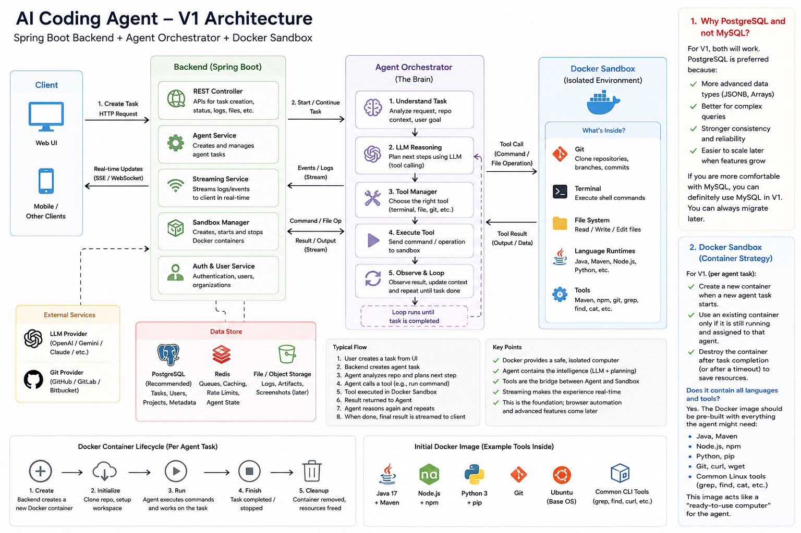

# AI Coding Agent

An AI coding agent (Devin-style) - Spring Boot backend, an LLM-driven agent
orchestrator, and per-task Docker sandboxes. Built as a portfolio project;
architectural decisions are logged as ADRs in `docs/architecture/` as they're
made, not written up after the fact.

## Architecture



- **Client** - Web/mobile, creates tasks, receives real-time updates.
- **Backend (Spring Boot)** - REST API, task lifecycle, auth, streams
  logs/events, manages sandbox containers.
- **Agent Orchestrator** - the reasoning loop: understand task -> plan via
  LLM -> pick a tool -> execute in sandbox -> observe -> repeat until done.
- **Docker Sandbox** - isolated per-task container with git, a shell, a
  filesystem, and language runtimes, so the agent can never touch the host.
- **Data store** - PostgreSQL (tasks/users/metadata), Redis (queues/cache,
  planned), object storage (logs/artifacts, planned).

## Current status

**Milestone 1: Backend skeleton** ✅
- [x] Task domain model (entity, JSONB context, Flyway migration)
- [x] REST API: create / get / list / cancel a task
- [x] Centralized task state machine with unit tests
- [x] Global exception handling

**Milestone 2: Sandbox Manager** ✅
- [x] `ContainerRuntime` port + `DockerContainerRuntime` adapter (docker-java)
- [x] `SandboxManager`: reuse-if-running / create-if-not, with a Postgres
      partial-unique-index guard against concurrent double-provisioning
- [x] Resource-limited containers (memory/CPU/pids caps, dropped
      capabilities, no-new-privileges, non-root in-container user)
- [x] Idle-sandbox reaper (`@Scheduled`)
- [x] Custom sandbox image (Java/Maven, Node/npm, Python/pip, git)
- [x] Unit tests against a fake `ContainerRuntime`

**Milestone 3: Auth & User Service** ✅
- [x] User entity + BCrypt password hashing
- [x] JWT issuance/validation (stateless, no revocation yet - see ADR-0004)
- [x] `/api/auth/register`, `/api/auth/login`
- [x] Real Spring Security filter chain (JSON 401/403, not the default
      whitelabel page)
- [x] `TaskController`/`SandboxController` retrofitted to
      `@AuthenticationPrincipal` instead of the `X-User-Id` stand-in header
- [x] `tasks.user_id` promoted to a real foreign key

**Milestone 4 (next): Streaming Service or Agent Orchestrator**
- [ ] Real-time streaming (SSE) for task logs
- [ ] Agent Orchestrator (LLM tool-calling loop)

## Running locally

```bash
docker compose up -d          # starts Postgres on :5432
cd backend
./mvnw spring-boot:run         # starts the API on :8080
```

### Required environment variables

`application.yml` is gitignored (matches how the JWT secret and DB
credentials are already handled) - set these before running:

| Variable | Used by |
|---|---|
| `GEMINI_API_KEY` | `GeminiClient` (orchestrator LLM calls) |

Corresponding `application.yml` snippet:

```yaml
gemini:
  api-key: ${GEMINI_API_KEY}
  model: gemini-2.0-flash
  request-timeout-seconds: 60
  max-requests-per-minute: 8
```

`max-requests-per-minute` bounds `GeminiRateLimiter`, a shared budget every
orchestrator thread waits on before calling Gemini - proactive, not just a
retry after a 429 already happened. Defaults to 8 if omitted, which leaves
margin under the free tier's ~10-15 RPM ceiling. Without this, running a
couple of tasks close together (`agentTaskExecutor` allows up to 4
concurrent orchestrator loops) can burst past the quota even for small
tasks, since each loop's own 429 retry has no visibility into what the
others are doing. Lower it further (e.g. `4`) if you're still seeing 429s
during development, or raise it if you've moved to a paid tier.

Swagger UI: `http://localhost:8080/swagger-ui.html`

Every endpoint except `/api/auth/**` and Swagger now requires a Bearer
token, issued via `/api/auth/register` or `/api/auth/login`.

### Example: register, then create a task

```bash
TOKEN=$(curl -s -X POST http://localhost:8080/api/auth/register \
  -H "Content-Type: application/json" \
  -d '{"email":"praveen@example.com","password":"password123","displayName":"Praveen"}' \
  | jq -r .token)

curl -X POST http://localhost:8080/api/tasks \
  -H "Content-Type: application/json" \
  -H "Authorization: Bearer $TOKEN" \
  -d '{
        "title": "Add pagination to /orders",
        "description": "Cursor-based pagination on the orders list endpoint",
        "repoUrl": "https://github.com/praveen7600/grocery-shop"
      }'
```

### Sandbox Manager

Build the sandbox image once, locally:

```bash
docker build -t ai-coding-agent-sandbox:latest infra/docker/sandbox
```

The backend needs access to the Docker socket to manage containers. When
running the backend outside Docker (e.g. via `./mvnw spring-boot:run` on
your host), it talks to `unix:///var/run/docker.sock` by default - no extra
setup needed on Linux. Manual test endpoints while the Orchestrator doesn't
exist yet:

```bash
TASK_ID=$(uuidgen)

curl -X POST http://localhost:8080/internal/sandboxes/$TASK_ID/ensure \
  -H "Authorization: Bearer $TOKEN"

curl -X POST http://localhost:8080/internal/sandboxes/$TASK_ID/exec \
  -H "Content-Type: application/json" \
  -H "Authorization: Bearer $TOKEN" \
  -d '{"command": ["git", "--version"]}'

curl -X DELETE http://localhost:8080/internal/sandboxes/$TASK_ID \
  -H "Authorization: Bearer $TOKEN"
```

### Large tasks vs. small tasks

Three config knobs directly affect whether a large, multi-step task can
finish, as opposed to a quick single-file change:

| Property | Default | What it controls |
|---|---|---|
| `orchestrator.max-iterations` | 20 | How many model round-trips `AgentOrchestrator`'s loop allows before giving up and failing the task. A large task (explore, edit several files, build, fix a compile error, test, fix a failing test) can easily need more turns than a small one - this was hardcoded at 8 originally, which failed exactly that kind of task with "Agent did not produce a final answer within 8 iterations." |
| `sandbox.exec-timeout-seconds` | 300 | How long a single `run_command` call is allowed to run before it's treated as timed out. Applies per-command, not per-task - a large task running a real build/test suite is far more likely to hit this than `echo` or `cat`. A timeout now comes back as a normal (if unsuccessful) tool observation the model can react to, not a thrown exception that kills the whole task. |
| `gemini.max-requests-per-minute` | 8 | Shared budget every orchestrator thread waits on before calling Gemini - see `GeminiRateLimiter`. More iterations means more Gemini calls per task, so a low value here can slow a large task down (it waits for a slot) without failing it outright. |

Tool output (stdout/stderr) is also capped at 8,000 characters per stream
before being added to the conversation history - `ToolExecutor` keeps the
head and tail and drops the middle, since a failing build's actionable
error is almost always at the end. This matters more for large tasks: their
commands tend to produce more output, and `generateContent` resends the
full history on every call, so untruncated output compounds in token cost
as a task's iteration count grows.

```yaml
orchestrator:
  max-iterations: 20
sandbox:
  exec-timeout-seconds: 300
```

## Architecture decisions

- [ADR-0001: PostgreSQL over MySQL](docs/architecture/ADR-0001-postgresql-vs-mysql.md)
- [ADR-0002: Centralized task state machine](docs/architecture/ADR-0002-task-state-machine.md)
- [ADR-0003: Sandbox Manager container runtime strategy](docs/architecture/ADR-0003-sandbox-container-strategy.md)
- [ADR-0004: Auth & User Service](docs/architecture/ADR-0004-auth-user-service.md)
- [ADR-0005: LLM Client — raw REST over SDK](docs/architecture/ADR-0005-llm-client.md)

## Tech stack

- Java 17, Spring Boot 3.3 (Web, Data JPA, Validation, Security, WebSocket)
- PostgreSQL 16, Flyway migrations
- Docker Engine API via docker-java (sandbox execution environment)
